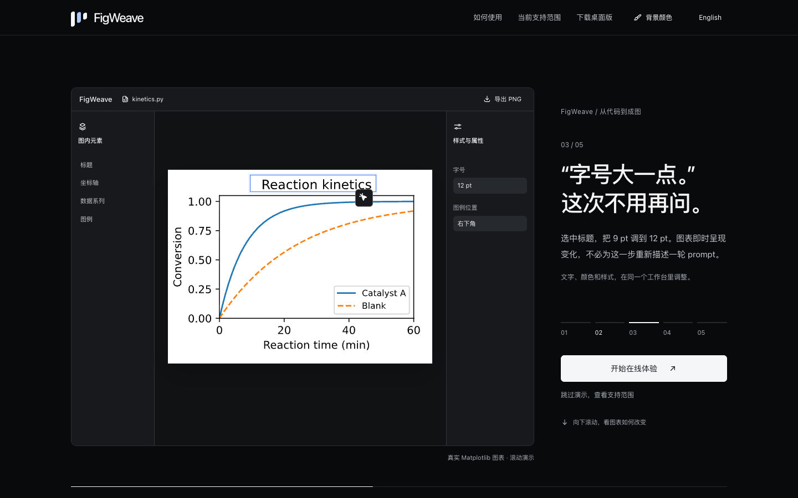
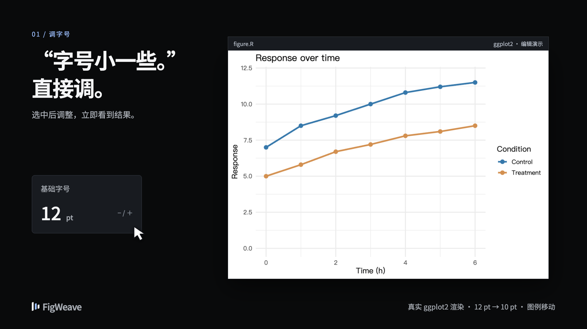
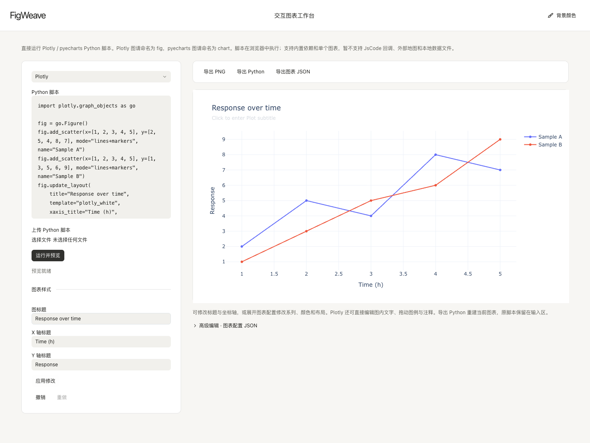
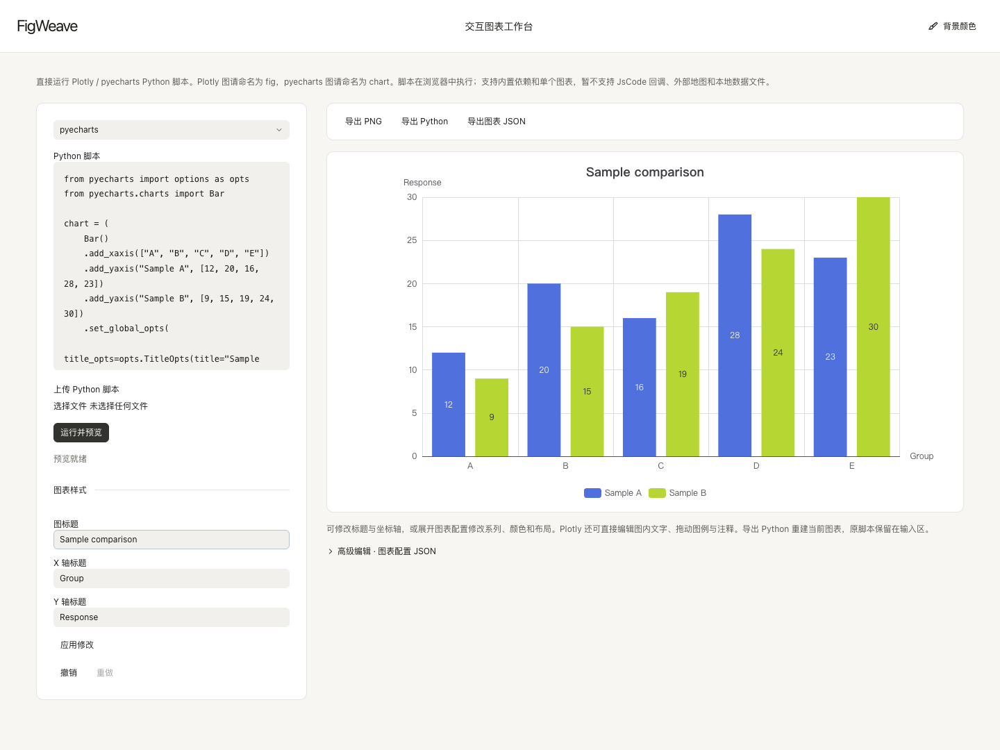
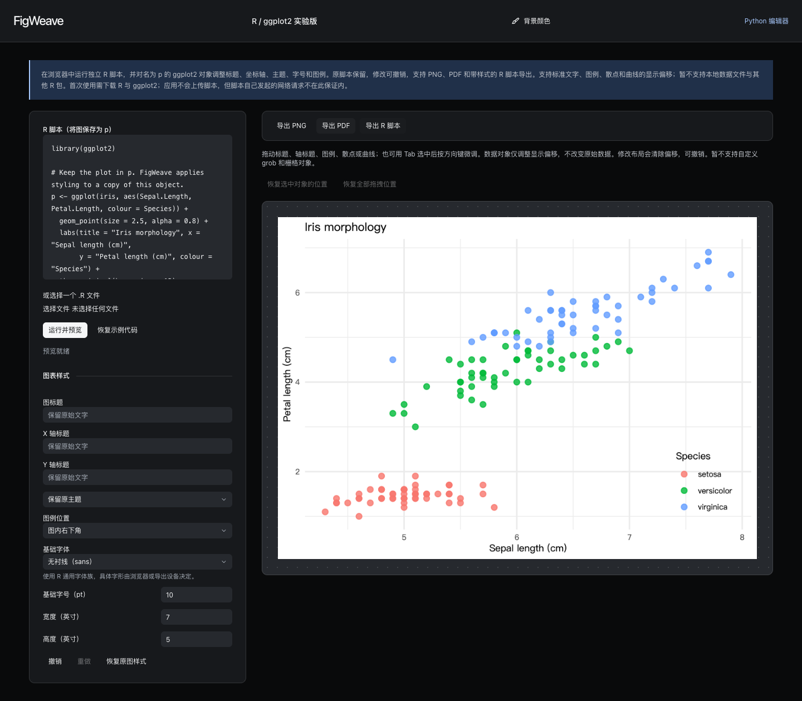
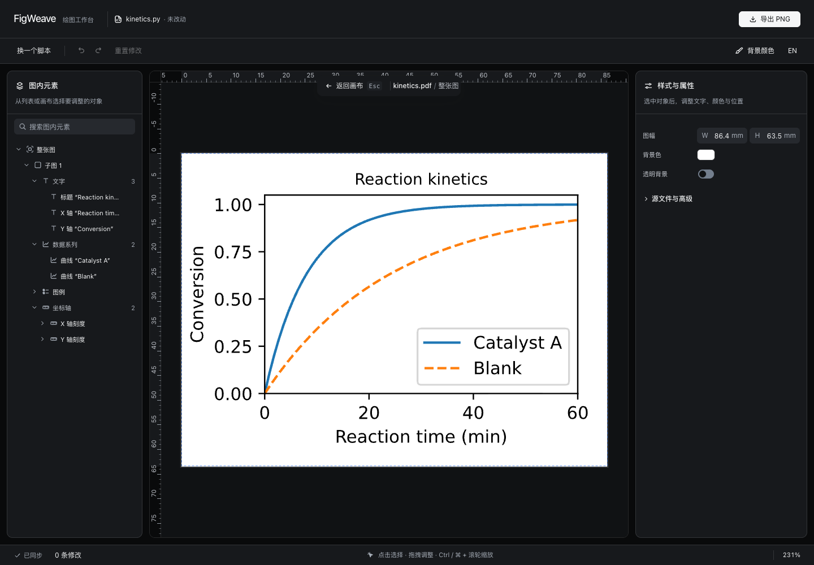

# FigWeave

[](https://github.com/eveque-dev/fig-weave/actions/workflows/figweave-web.yml)
[](https://github.com/eveque-dev/fig-weave/actions/workflows/figweave-preview.yml)
[](https://github.com/eveque-dev/fig-weave/releases/tag/figweave-preview-0.15.0-20260922)
[](LICENSE)
[](https://fig-weave.com)

**把绘图脚本变成可以继续编辑的图表。**

FigWeave 是面向科研与数据可视化的图表编辑项目。直接打开网页，运行 Python 或 R
脚本，再调整图中文字、图例、样式与位置。在线界面默认简体中文和曜石黑主题，支持英文和七种
背景色；界面背景与图纸背景分别管理。

[打开官网](https://fig-weave.com) · [Matplotlib 编辑器](https://fig-weave.com/try/) ·
[Plotly / pyecharts 工作台](https://fig-weave.com/charts/) · [ggplot2 工作台](https://fig-weave.com/r/)



*首页通过滚动演示图表对象选择、字号调整、图例移动与导出；工作台仍可直接打开。*

## 32 秒看看怎么用

[](https://fig-weave.com/#film)

**“图例放左下角”“字号再小一点”——少补几轮 prompt，直接在图上调。**
新版短片以曜石黑为主色，只有音效、无人声；同一张图贯穿零散 prompt、字号与图例调整、实际 R 脚本导出和成品展示。
[观看 / 下载 MP4](https://github.com/eveque-dev/fig-weave/releases/download/figweave-preview-0.15.0-20260922/FigWeave-promo-1080p.mp4) ·
[视频源码与复现方式](promo-video/README.md) · [小红书文案](docs/promo/xiaohongshu.md)

## 现在可以做什么

| 入口 | 输入 | 编辑与输出 |
| --- | --- | --- |
| **Matplotlib** `/try/` | 独立 Python 脚本；支持 seaborn、pandas plotting、NetworkX 生成的 Matplotlib 图 | 复用对象编辑器，调整文字、图例、曲线与布局，支持撤销及带当前修改的高清 PNG 导出（宽 2400 像素） |
| **Plotly** `/charts/` | Python 脚本，图对象命名为 `fig` | 修改标题、轴名、系列与布局配置；直接编辑文字、移动图例和注释；撤销及 PNG / JSON / Python 导出 |
| **pyecharts** `/charts/` | Python 脚本，图对象命名为 `chart` | 修改标题、轴名与原生图表配置；撤销及 PNG / JSON / Python 导出 |
| **ggplot2** `/r/` | R 脚本，图对象命名为 `p` | 调整主题、字号、尺寸；拖动标准文字、图例、散点和曲线；撤销及 PNG / PDF / R 脚本导出 |

ggplot2 的数据点和曲线拖动保存为**显示偏移**，不改原始数据值。鼠标拖动和键盘
方向键都可操作；改变布局会清除偏移，撤销可以恢复。自定义 grob、栅格图元尚不支持。

Plotly / pyecharts 导出的 Python 用当前配置重建图表，不包含原脚本的数据处理过程。
目前接收单个图表，暂不支持 JsCode 回调、外部地图、本地数据文件或任意 `pip install`。
完整边界见 [在线版说明](docs/figweave-online.md)。

## 工作台实景

### Python · Plotly



运行 `fig` 后修改标题、坐标轴和原生配置，也可直接编辑图中文字与图例。

### Python · pyecharts



运行 `chart` 后编辑图表，导出 PNG、JSON 或可重新执行的 Python 脚本。

### R · ggplot2



选中图内对象后拖动，或用方向键微调；支持标准文字、图例、点、曲线，并可撤销和导出。
以上图片均来自实际工作台运行。

## 开始使用

1. 打开对应工作台，先运行自带示例。
2. 粘贴或上传独立的 `.py` / `.R` 脚本，按工作台约定命名图对象。
3. 运行后编辑图表；不满意时撤销，再导出当前结果。

首次使用需下载浏览器中的 Python / R 运行时和锁定的依赖。应用不会把脚本上传到
服务器，也不会把脚本写入浏览器持久存储；脚本自己发起的网络请求不在此保证内。
语言偏好保存在当前浏览器中；每次打开页面默认曜石黑，背景可在当前页面切换。刷新页面会丢失尚未导出的编辑会话。

## 选择自己的工作背景



背景选择包含曜石黑、纸白、纯白、灰、蓝、绿、紫七种方案；每次打开页面默认曜石黑，图纸本身的颜色不变。

## 桌面预览安装包

Windows x64 `.exe` 与 macOS Apple Silicon `.dmg` 已通过 GitHub Actions 自动构建和
内置引擎冒烟验证，可在 [FigWeave 0.15.0 预览 Release](https://github.com/eveque-dev/fig-weave/releases/tag/figweave-preview-0.15.0-20260922)
下载预览版本，无需登录 GitHub。Release 附带校验值和准确构建提交。

| 平台 | 当前状态 |
| --- | --- |
| Windows x64 | [下载 EXE](https://github.com/eveque-dev/fig-weave/releases/download/figweave-preview-0.15.0-20260922/FigWeave_0.15.0_windows_x64.exe) · 未签名预览，首次运行可能出现 SmartScreen 提示 |
| macOS Apple Silicon | [下载 DMG](https://github.com/eveque-dev/fig-weave/releases/download/figweave-preview-0.15.0-20260922/FigWeave_0.15.0_macos_arm64.dmg) · 未签名、未公证，尚非正式发行版 |
| macOS Intel / Windows ARM | 没有构建对应安装包，也没有完成平台验证 |
| Linux | 本项目暂不提供桌面安装包，可使用在线入口 |

Windows on ARM: neither built nor verified for this preview.

预览安装包目前保持原有的 **Matplotlib 本地编辑引擎**；本次新增的 R、Plotly、
pyecharts 工作台先在网页版提供，尚未打包为桌面离线能力。自动更新关闭。
平台口径以 [支持矩阵](docs/support-matrix.json) 中的 `figweave_distribution` 为准；
其中 `targets` 部分保留的是上游 Tavotto 的支持记录。

## 本地开发

普通用户无需安装开发工具；下面的命令用于修改源码。

前端使用 Node.js 与 pnpm，构建脚本使用 Python 3.10–3.14。从仓库根目录运行：

```sh
cd web
pnpm install --frozen-lockfile
cd ..
python3 scripts/build_figweave_site.py
python3 -m http.server 4173 --bind 127.0.0.1 --directory web/dist-site
```

访问 `http://127.0.0.1:4173/`。独立网站产物位于 `web/dist-site/`，包含 `/try/`、
`/charts/` 与 `/r/`。部署与运行时镜像说明见 [在线版构建文档](docs/figweave-online.md)。

- npm 依赖通过 `web/.npmrc` 使用国内镜像。
- 额外 Python 图表 wheel 优先从阿里云镜像获取，并校验锁文件中的 SHA-256。
- Pyodide 的 WebAssembly 包不能替换为普通 PyPI 本机 wheel，使用锁定版本并自托管。
- R 包按锁文件校验后随网站分发，webR 核心使用锁定的官方版本。

常用检查：

```sh
cd web
pnpm test
pnpm build
pnpm i18n:check
cd ..
ruff check .
ruff format --check .
python3 scripts/build_browser_playground.py --check
```

更多目录规则见 [AGENTS.md](AGENTS.md)。当前改进记录见
[项目审查与改进清单](docs/figweave-review-2026-09-22.md)。

## 来源与许可证

FigWeave 基于 [Tavotto](https://github.com/Tavotto/Tavotto) 开发，保留其版权、
许可证与来源说明。本仓库以 **AGPL-3.0-only** 分发，详见 [LICENSE](LICENSE)。
网站页脚提供与部署版本对应的源代码下载。

`src/tavotto`、Python 包名、CLI、文件格式和部分存储键暂时保留上游技术标识，
不代表 FigWeave 使用上游的发行或自动更新渠道。上游教程、截图和安装包可在
[Tavotto 原仓库](https://github.com/Tavotto/Tavotto) 查阅。


上游插件用户可查阅 [在 Codex 中第一次使用 Tavotto](docs/upstream-codex-zh-CN.md)
（[English](docs/upstream-codex-en.md)）；这不是 FigWeave 的安装渠道。
上游 Tavotto™ 是未注册商标，见 [商标政策](TRADEMARKS.md)。
贡献与授权资料：[贡献指南](CONTRIBUTING.md) · [上游法律文档](docs/legal/README.md)。
