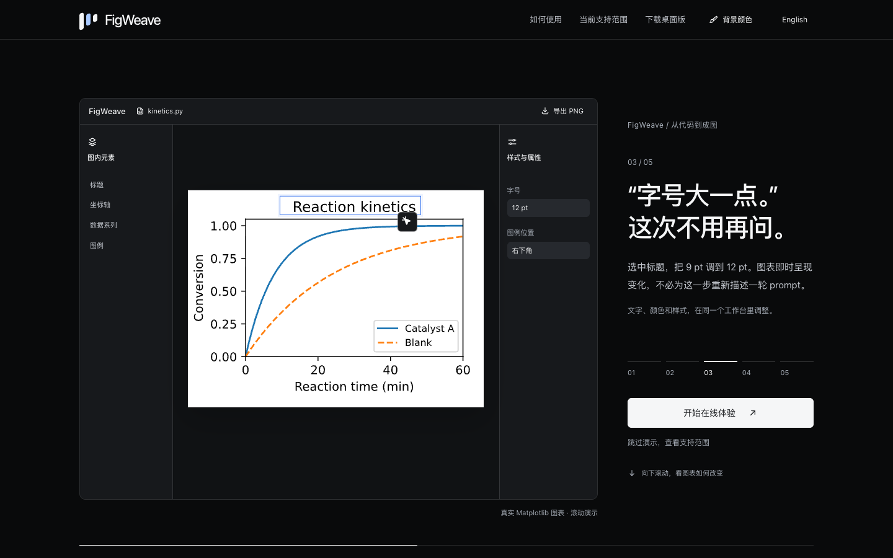
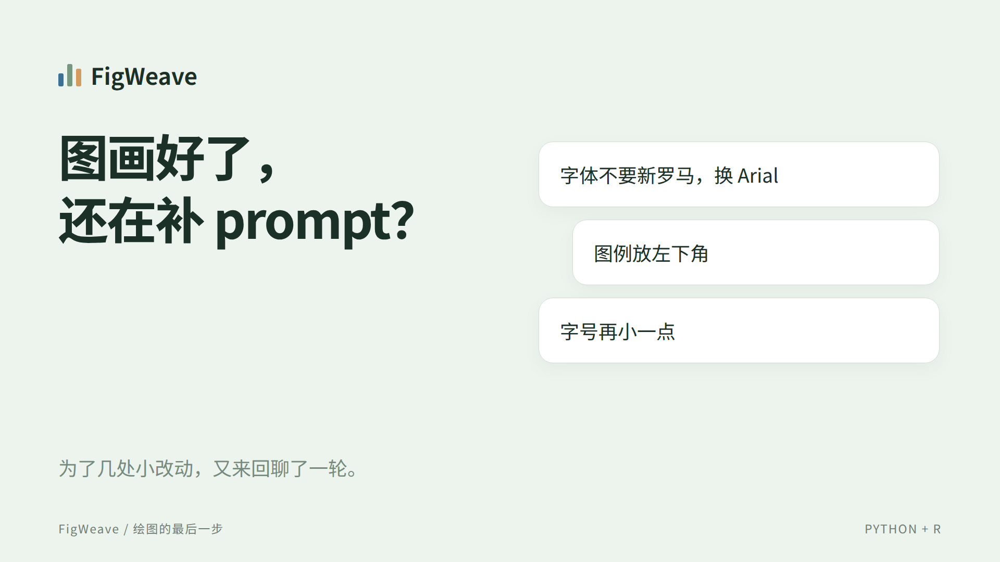
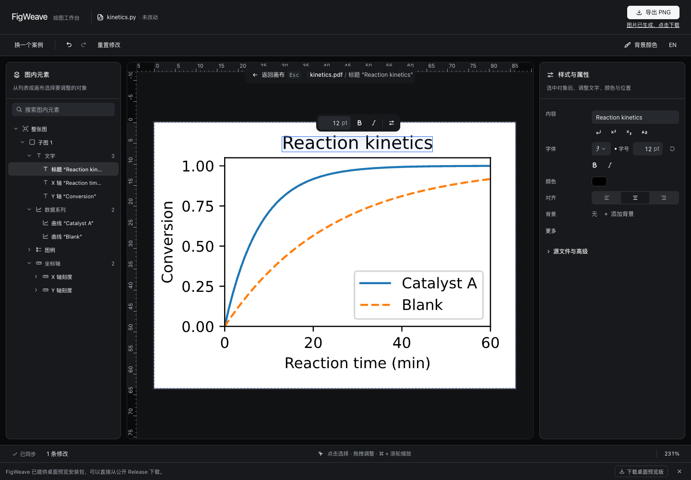
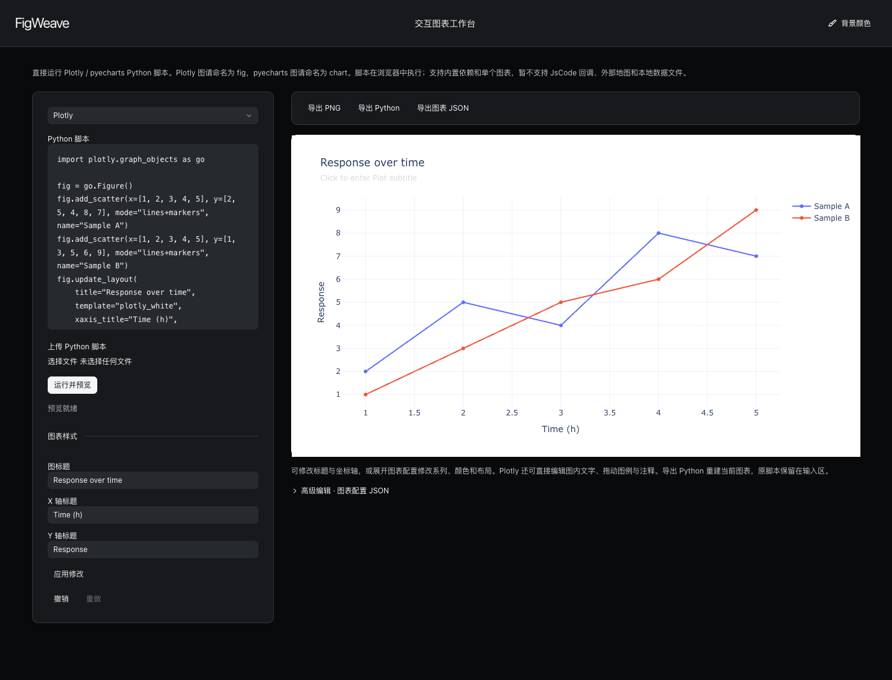
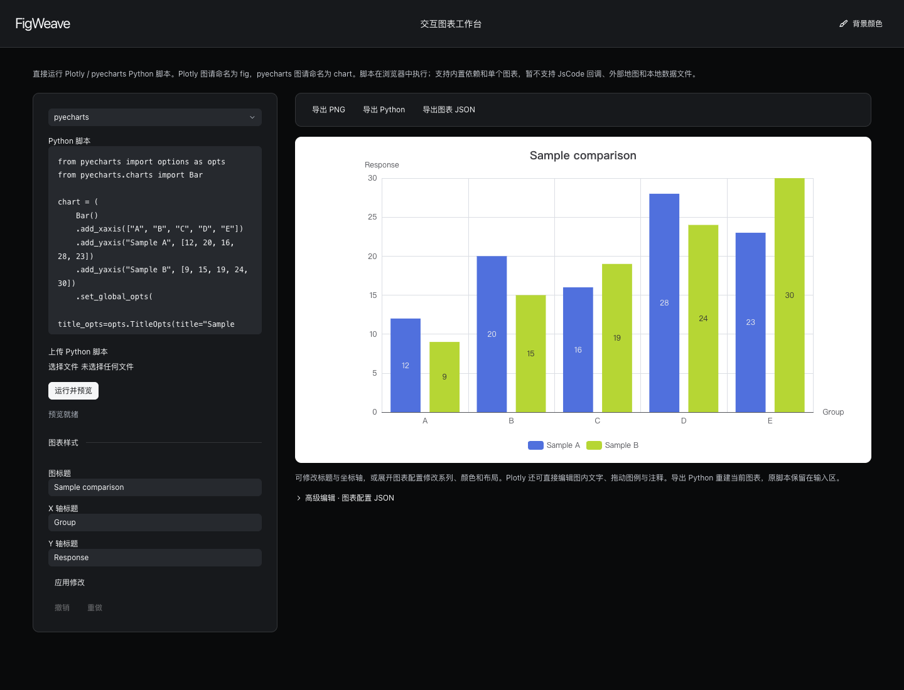
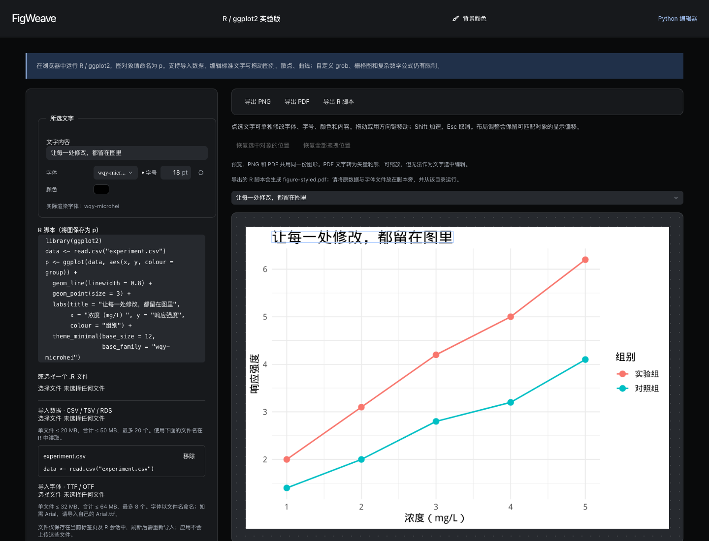
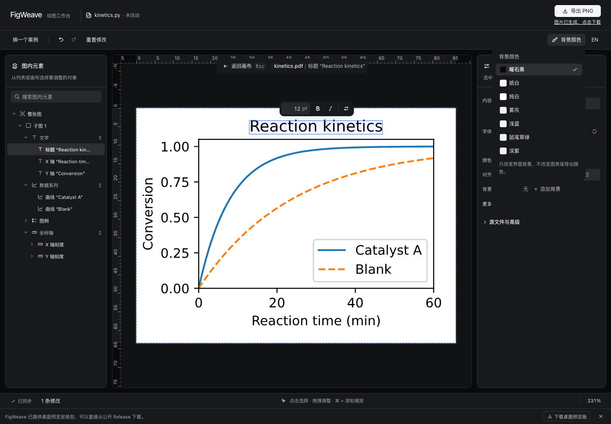

<p align="center">
  <a href="https://fig-weave.com">
    
  </a>
</p>

<h1 align="center">FigWeave</h1>

<p align="center">
  <strong>代码画图，直接在图上完成最后一步。</strong><br />
  面向科研与数据可视化的 Python / R 图表编辑器。
</p>

<p align="center">
  <a href="https://github.com/eveque-dev/fig-weave/actions/workflows/figweave-web.yml"></a>
  <a href="https://github.com/eveque-dev/fig-weave/actions/workflows/figweave-preview.yml"></a>
  <a href="https://github.com/eveque-dev/fig-weave/releases/tag/figweave-preview-0.15.0-20260922"></a>
  <a href="LICENSE"></a>
  <a href="https://www.buymeacoffee.com/eveque"></a>
</p>

<p align="center">
  <a href="https://fig-weave.com"><strong>在线体验</strong></a> ·
  <a href="#开始使用">快速开始</a> ·
  <a href="#现在可以做什么">功能范围</a> ·
  <a href="#桌面预览安装包">桌面下载</a> ·
  <a href="#本地开发">本地开发</a> ·
  <a href="#支持与贡献">支持与贡献</a>
</p>

---

运行一段 Python 或 R 绘图脚本，再直接选择图中的文字、图例和其他元素，调整样式与位置，导出当前结果。
FigWeave 把代码的可复现性与图形界面的直观编辑结合起来，适合科研图表的最后一轮微调。

- **熟悉的绘图库**：Matplotlib、seaborn、pandas、NetworkX、Plotly、pyecharts 和 ggplot2。
- **在图上编辑**：选择元素、修改文字与样式、调整布局，支持撤销。
- **浏览器内运行**：无需为在线体验配置本地 Python / R 环境；导出能力按绘图引擎区分。
- **中文优先**：默认简体中文与曜石黑，支持英文和七种工作背景；界面与图纸背景独立。



<p align="center"><sub>首页滚动演示图表微调；下方工作台截图来自真实运行。</sub></p>

## 开始使用

选择你的绘图库，无需安装即可在线体验：

| Python · Matplotlib | Python · Plotly / pyecharts | R · ggplot2 |
| :---: | :---: | :---: |
| [打开工作台](https://fig-weave.com/try/) | [打开工作台](https://fig-weave.com/charts/) | [打开工作台](https://fig-weave.com/r/) |

1. 打开对应工作台，先运行自带示例。
2. 粘贴或上传独立的 `.py` / `.R` 脚本，按工作台约定命名图对象。
3. 运行后编辑图表；不满意时撤销，再导出当前结果。

首次使用需下载浏览器中的 Python / R 运行时和锁定的依赖。应用不会把脚本上传到
服务器，也不会把脚本写入浏览器持久存储；脚本自己发起的网络请求不在此保证内。
语言偏好保存在当前浏览器中；每次打开页面默认曜石黑，背景可在当前页面切换。刷新前可下载本地项目文件；在对应入口打开项目后，点击运行恢复图表、编辑和撤销记录。项目文件不会上传或自动写入浏览器持久存储。

## 使用统计后台

站点管理员可在 [使用统计后台](https://fig-weave.com/admin/) 独立登录，查看历史页面访问、成功绘图的匿名浏览器数、导出次数、每日趋势与 CSV 日报。访问次数不是人数；实际使用只统计明确同意后的浏览器，未选择或关闭统计时不会发送使用事件，也不生成标识。偏好可通过在线页面左下角的「匿名统计」随时修改。

统计不包含脚本、图表、文件名、路径、图内文字或 IP。部署、权限和完整口径见 [后台说明](services/figweave_admin/README.md)。

## 33 秒看看怎么用

[](https://fig-weave.com/#film)

**“图例放左下角”“字号再小一点”——少补几轮 prompt，直接在图上调。**
视频展示 R 图表编辑与脚本导出，并介绍三个在线入口；只有操作音效，无配乐、无人声。

[观看 / 下载 MP4](https://github.com/eveque-dev/fig-weave/releases/download/figweave-preview-0.15.0-20260922/FigWeave-promo-1080p.mp4) ·
[视频源码与复现方式](promo-video/README.md)

## 现在可以做什么

| 入口 | 输入 | 编辑与输出 |
| --- | --- | --- |
| **Matplotlib** `/try/` | 独立 Python 脚本；支持 seaborn、pandas plotting、NetworkX 生成的 Matplotlib 图 | 复用对象编辑器，调整文字、图例、曲线与布局，支持撤销及带当前修改的高清 PNG 导出（默认宽 2400 像素，可调整并保持比例） |
| **Plotly** `/charts/` | Python 脚本，图对象命名为 `fig` | 修改标题、轴名、系列与布局配置；直接编辑文字、移动图例和注释；撤销及 PNG / JSON / Python 导出 |
| **pyecharts** `/charts/` | Python 脚本，图对象命名为 `chart` | 修改标题、轴名与原生图表配置；撤销及 PNG / JSON / Python 导出 |
| **ggplot2** `/r/` | R 脚本 + CSV / TSV / RDS，图对象命名为 `p` | 单独编辑文字内容、字体、字号与颜色；导入 TTF / OTF，支持中文；拖动文字、图例、散点和曲线并保留可匹配对象的偏移；撤销及一致的 PNG / PDF / R 脚本导出 |

ggplot2 的数据点和曲线拖动保存为**显示偏移**，不改原始数据值。鼠标拖动和键盘
方向键都可操作。调整字号、标题或主题时，能匹配的对象保留显示偏移；隐藏对象的记录
会保留并提示。重新运行源码会开始新的编辑会话。自定义 grob、栅格图元尚不支持。

R 工作台可导入 CSV / TSV / RDS 数据，文件只保存在当前标签页。中文使用内置的
文泉驿字体；如需 Arial，可导入自己的 Arial.ttf。预览、PNG 和 PDF 共用同一份图形，
缺字或字体替代会显示提示。PDF 文字转为矢量轮廓，不能作为文字选中编辑。导出的 R
脚本会生成 `figure-styled.pdf`；请将数据与字体文件放在脚本旁，并从该目录运行。

Plotly / pyecharts 单独导出的 Python 用当前配置重建图表。下载复现包会另外保留原始脚本及其数据处理过程。
目前接收单个图表，暂不支持 JsCode 回调、外部地图、本地数据文件或任意 `pip install`。
完整边界见 [在线版说明](docs/figweave-online.md)。

## 保存项目与复现

三个在线工作区都提供 **保存项目 / 打开项目 / 下载复现包**。项目文件保存源码、
当前编辑、撤销与重做记录、PNG 宽度；R 项目还包含导入的数据与字体。打开文件
只读取内容，由用户点击运行后恢复，失败时保留输入供重试。

PNG 默认宽 2400 像素，可设为 320–8192 像素，按图幅比例计算高度，并限制总像素
预算。R 的 PNG 从同一份最终 PDF 生成；Charts 按实际渲染比例导出。

复现 ZIP 包含项目状态、原始脚本、编辑重放脚本、运行时与依赖锁、许可证及使用说明。
Matplotlib 包还附同一份渲染引擎；R 包保留导入资产，需将 `assets/` 中的文件放到重放
脚本旁。接收端仍需安装依赖，跨平台字体渲染可能不同。[格式、边界与验收](docs/figweave-online-projects.md)。

## 工作台实景

以下截图拍摄于 **2026-09-28**，来自当前线上中文、曜石黑界面；四个绘图库都实际运行并验证了 PNG 下载。
[截图版本与复现方式](assets/figweave/README.md)。首页图片为滚动演示，下面是可操作的工作台。

<details>
<summary>展开四个工作台的实景截图</summary>

### Python · Matplotlib



直接选择图内元素，在右侧调整样式；右上角的「导出 PNG」下载带当前修改的高清图片。

### Python · Plotly



运行 `fig` 后修改标题、坐标轴和原生配置，也可直接编辑图中文字与图例。

### Python · pyecharts



运行 `chart` 后编辑图表，导出 PNG、JSON 或可重新执行的 Python 脚本。

### R · ggplot2



选中标题、轴名或图例文字后可单独修改字体、字号、颜色和内容；拖动或用方向键微调位置。
数据文件与字体均在当前浏览器会话中读取，改完可撤销并导出。
以上图片均来自实际工作台运行。

</details>

## 选择自己的工作背景



背景选择包含曜石黑、纸白、纯白、灰、蓝、绿、紫七种方案；每次打开页面默认曜石黑，图纸本身的颜色不变。

## 桌面预览安装包

Windows x64 `.exe` 与 macOS Apple Silicon `.dmg` 已通过 GitHub Actions 自动构建和
内置引擎冒烟验证，可在 [FigWeave 0.15.0 预览 Release](https://github.com/eveque-dev/fig-weave/releases/tag/figweave-preview-0.15.0-20260922)
下载预览版本，无需登录 GitHub。Release 附带校验值和准确构建提交。

| 平台 | 当前状态 |
| --- | --- |
| Windows x64 | [下载 EXE](https://github.com/eveque-dev/fig-weave/releases/download/figweave-preview-0.15.0-20260922/FigWeave_0.15.0_windows_x64.exe) · 未签名预览，首次运行可能出现 SmartScreen 提示 |
| macOS Apple Silicon | [下载 DMG](https://github.com/eveque-dev/fig-weave/releases/download/figweave-preview-0.15.0-20260922/FigWeave_0.15.0_macos_arm64.dmg) · 未签名、未公证，尚非正式发行版 |
| macOS Intel / Windows ARM | 没有构建对应安装包，也没有完成平台验证 |
| Linux | 本项目暂不提供桌面安装包，可使用在线入口 |

Windows on ARM: neither built nor verified for this preview.

预览安装包目前保持原有的 **Matplotlib 本地编辑引擎**；本次新增的 R、Plotly、
pyecharts 工作台先在网页版提供，尚未打包为桌面离线能力。自动更新关闭。
平台口径以 [支持矩阵](docs/support-matrix.json) 中的 `figweave_distribution` 为准；
其中 `targets` 部分保留的是上游 Tavotto 的支持记录。

## 本地开发

普通用户无需安装开发工具；下面的命令用于修改源码。

前端使用 Node.js 与 pnpm，构建脚本使用 Python 3.10–3.14。从仓库根目录运行：

```sh
cd web
pnpm install --frozen-lockfile
cd ..
python3 scripts/build_figweave_site.py
python3 -m http.server 4173 --bind 127.0.0.1 --directory web/dist-site
```

访问 `http://127.0.0.1:4173/`。独立网站产物位于 `web/dist-site/`，包含 `/try/`、
`/charts/` 与 `/r/`。部署与运行时镜像说明见 [在线版构建文档](docs/figweave-online.md)。

- npm 依赖通过 `web/.npmrc` 使用国内镜像。
- 额外 Python 图表 wheel 优先从阿里云镜像获取，并校验锁文件中的 SHA-256。
- Pyodide 的 WebAssembly 包不能替换为普通 PyPI 本机 wheel，使用锁定版本并自托管。
- R 包按锁文件校验后随网站分发，webR 核心使用锁定的官方版本。

常用检查：

```sh
cd web
pnpm test
pnpm build
pnpm i18n:check
cd ..
ruff check .
ruff format --check .
python3 scripts/build_browser_playground.py --check
```

更多目录规则见 [AGENTS.md](AGENTS.md)。当前改进记录见
[项目审查与升级优先级（2026-09-28）](docs/figweave-review-2026-09-28.md)。

## 支持与贡献

如果 FigWeave 帮你省下了整理图表的时间，欢迎请作者喝杯咖啡。

<a href="https://www.buymeacoffee.com/eveque"></a>

也欢迎通过 [报告问题](https://github.com/eveque-dev/fig-weave/issues)、改进文档或提交代码来参与项目。
提交改动前请阅读 [贡献指南](CONTRIBUTING.md)；本地开发与验证入口见上文。

## 来源与许可证

FigWeave 基于 [Tavotto](https://github.com/Tavotto/Tavotto) 开发，保留其版权、
许可证与来源说明。本仓库以 **AGPL-3.0-only** 分发，详见 [LICENSE](LICENSE)。
网站页脚提供与部署版本对应的源代码下载。

`src/tavotto`、Python 包名、CLI、文件格式和部分存储键暂时保留上游技术标识，
不代表 FigWeave 使用上游的发行或自动更新渠道。上游教程、截图和安装包可在
[Tavotto 原仓库](https://github.com/Tavotto/Tavotto) 查阅。

上游插件用户可查阅 [在 Codex 中第一次使用 Tavotto](docs/upstream-codex-zh-CN.md)
（[English](docs/upstream-codex-en.md)）；这不是 FigWeave 的安装渠道。
上游 Tavotto™ 是未注册商标，见 [商标政策](TRADEMARKS.md)。
贡献与授权资料：[贡献指南](CONTRIBUTING.md) · [上游法律文档](docs/legal/README.md)。

FigWeave 是基于 Tavotto 的独立派生项目。多绘图库在线工作台、按引擎导出与中文体验的差异，以及展示素材来源，见 [差异与素材说明](docs/promo/identity-and-sources.md)。
