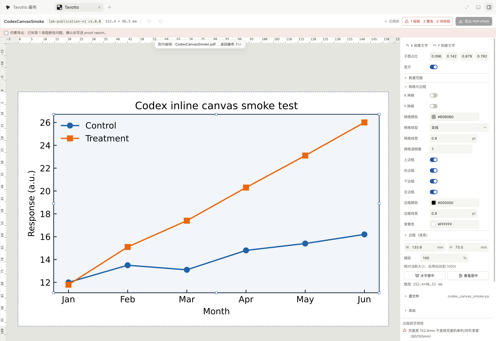

# 真实 Codex Desktop 内嵌画布验收

这份验收只回答一件事：**真实 Codex Desktop 在一次真实 Tavotto 工具调用后，是否把
MCP App 资源渲染成任务内的交互画布。** pytest 的协议测试、浏览器里打开 HTML、
外部 Tavotto 窗口与 `codex exec` 的结构化输出都不能代替它。

## 前置条件

1. 记录待验 commit：`git rev-parse HEAD`，工作树必须没有未说明的改动。
2. 从该 checkout 安装插件，并记录 `codex --version` 与 `codex plugin list --json`。
3. 安装或升级插件后，**新建一个 Codex Desktop 任务**。已打开的任务不会重新加载
   MCP server；在旧任务里看到 `Transport closed` 不是新实现的验收结果。
4. 新任务的工作目录设为这个 checkout。不得预设 `TAVOTTO_MCP_ROOTS` 或任何
   `CODEX_*WORKSPACE*` 兼容变量。

验收使用仓库自带、数值固定的
`tests/acceptance/corpus/c01_lines_scatter_bars.py`，不临时编造图片或 HTML。

## A. capability 与 fail-closed 证据

先让 Codex 只调用 `tavotto_health`。保存完整 structuredContent，并确认：

- `canvas.available == true`；
- `canvas.resource_uri == "ui://tavotto/canvas/v1.html"`；
- `root_authority.client` 记录真实 client/version/protocol；
- `root_authority.client.capabilities.advertised` 来自握手原文；
- 尚未授权时，插件 cwd 不会出现在 `roots`。

第一次调用 open 时传 checkout 下 corpus 的**绝对路径**和 `stem: "c01_line"`。在
确认框先选拒绝/取消：工具必须返回 `workspace_confirmation_declined` 或
`workspace_confirmation_cancelled`，不得建立 session、不得弹浏览器或外部桌面窗口。

## B. 正向 Desktop 证据

再次调用相同 open。确认框必须：

- 显示 corpus 的完整 realpath；
- 默认未批准；
- 说明只在当前 Tavotto MCP 连接内有效。

核对路径后批准。通过需要同时满足：

1. 工具结果成功，含非空 `session_id`、`stem == "c01_line"` 与
   `canvas_ui.available == true`；
2. 原始 MCP `tools/list` 描述符的 `_meta.ui.resourceUri` 和
   `_meta["openai/outputTemplate"]` 都等于 `ui://tavotto/canvas/v1.html`；若宿主把
   `CallToolResult._meta` 隐藏在模型工具包装层之外，以协议录制为准，不能据包装层
   缺字段误判 server 没有发送；
3. Codex 任务内实际出现 iframe 画布，能看到标题 **Basic line**、两条曲线与图例；
4. 画布不是浏览器 tab，也不是 Tavotto 外部窗口；
5. 再调 health，`root_authority.source == "user_elicitation"`，根恰好是 corpus
   realpath，`workspace_confirmation.lifetime == "mcp_connection"`。

最后在画布里移动图例或改一个可编辑样式，确认画布收到新的服务端 SVG/manifest；关闭
session。这个交互步骤用来排除“host 只画了一张静态截图”的假绿。

## C. 必须留存的证据

PR 至少附：

| 证据 | 必须包含 |
| --- | --- |
| 环境文本 | commit SHA、Codex 版本、插件安装路径/版本、OS |
| capability JSON | `root_authority.client`、`mcp_roots`、`workspace_confirmation` |
| 负向结果 | 取消后的机器可读 code，且无 session |
| 确认截图 | 完整规范路径与默认未批准状态；可遮住用户名以外的无关信息 |
| 画布截图 | 同一任务里的 Tavotto 工具卡、Basic line 画布与 Codex 外框 |
| 正向工具结果 | session/stem/canvas_ui 与两项 UI resource metadata |

任何一项缺失都应写成“未验证/被阻塞”，不能把自动化协议绿灯改写成“Desktop 已通过”。

## 已知的非交互对照

`codex exec --ephemeral --json` 会真实声明 `elicitation`，但没有真人 UI 时会返回
`action: "cancel"`。Tavotto 必须据此拒绝访问。这条对照证明没有自动批准后门；它不是
Desktop 正向证据。

## 2026-08-24 参考验收记录

- 环境：macOS 26.6.1 (25G76)，Codex Desktop 26.818.41509 (6962)，
  `codex-cli 0.149.1`，Tavotto engine/plugin 0.9.2。
- 真实 client 握手：`codex-mcp-client/0.149.1`，MCP `2025-06-18`；advertised
  capability 只有 `elicitation`，没有 `roots`，因此正向路径由 exact-realpath
  elicitation 授权，生命周期为当前 MCP connection。
- 负向对照：无 UI 的真实 `codex exec --ephemeral --json` 对 elicitation 返回
  cancel；server 返回 `workspace_confirmation_cancelled`，没有建立 session。
- 正向 Desktop：用户在原生确认框批准测试图库 realpath 后，
  `tavotto_open_figure` 返回 `CodexCanvasSmoke`、28 个可编辑元素、
  `152.4 × 96.52 mm` 和非空 SVG；Codex 任务内出现画布、属性页、预检与导出控件。
- 交互：画布内选择/拖动后，Desktop 日志连续记录
  `mcpServer/tool/call`，界面显示“已同步”并把预检标为过期；关闭该临时 session 后
  重新 open，patch hash 回到空列表 canonical hash，尺寸回到脚本原值，证明没有改源码。

这次真实验收同时抓到并修复了两条自动化原先漏掉的错误：

1. MCP Apps `ui/notifications/tool-result` 的 `params` 本身就是标准
   `CallToolResult`；旧 fake host 错包成 `{ result: CallToolResult }`，导致 Codex
   是否能靠兼容全局兜底变成竞态。e2e 现在发送标准直出形状，并保留旧包装兼容。
2. MCP 独立入口漏了桌面版与 playground 都有的 `TooltipProvider`；完整 28 元素
   manifest 一进入属性检查器就会崩。独立 provider 单测保证以后不能再删掉。

